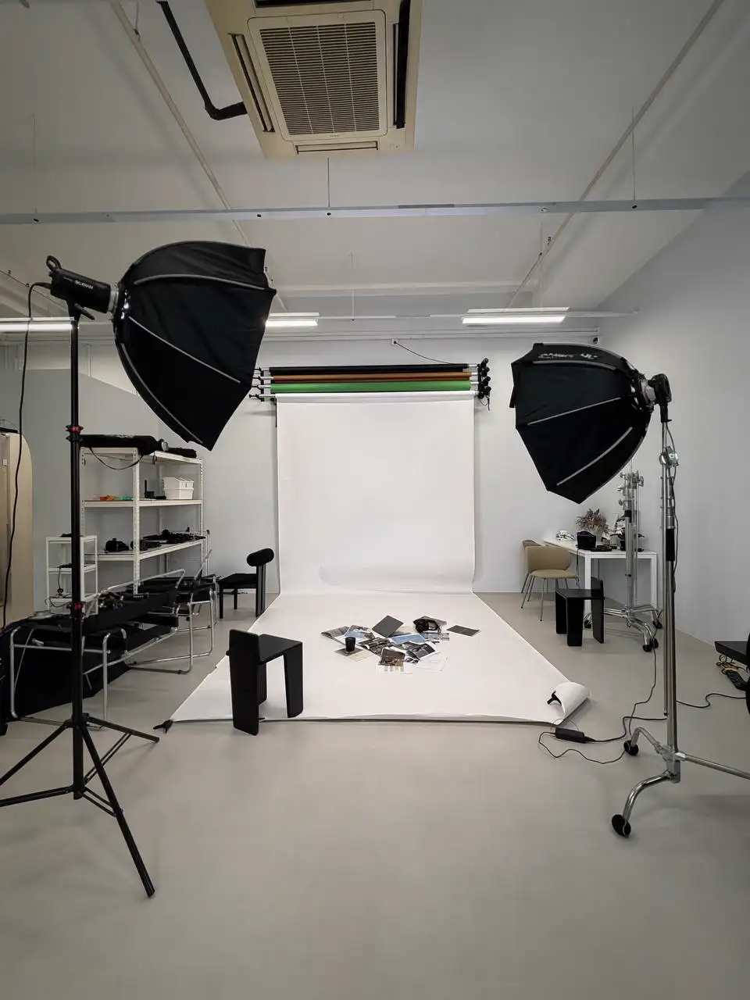
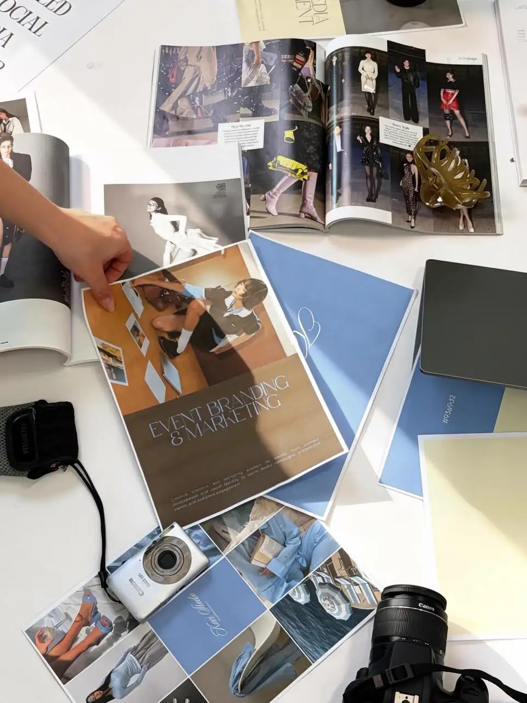

# KACISTUDIO Rollback Reference

**Date:** 2026-06-23  
**Scope:** Local server start plus homepage/about-page section removals

This file documents what was changed so removed sections can be restored later if needed.

---

## Local Website Server

The website was started from:

```text
C:\Users\darry\OneDrive\Desktop\Project\KacisStudio
```

It uses the existing static Node server:

```text
serve.mjs
```

Verified local URL:

```text
http://localhost:3000/
```

Verification performed:

```text
http://localhost:3000/ returned 200 OK
http://localhost:3000/about.html returned 200 OK
```

---

## `index.html`

### Removed Section

Removed the homepage selected work preview section:

```text
SELECTED WORK 02
Stories we've
helped bring to life.
```

The removed block was:

```html
<!-- ============= Work preview ============= -->
<section id="section-work" class="section">
  ...
</section>
```

It included:

- Heading: `SELECTED WORK 02`
- Heading text: `Stories we've helped bring to life.`
- `View all work` button linking to `work.html`
- Three work cards:
  - `Resurrack x LittleMissMarket`
  - `Flyco`
  - `Brixx Derma`

### Related Cleanup

The old work section background rule was removed because `#section-work` no longer exists:

```css
#section-work { background: var(--bg-alt); }
```

The divider after services was updated so the page now blends directly from services into client love:

```css
.blend-bgalt-to-olive { background: linear-gradient(to bottom, var(--bg-alt), var(--olive)); }
```

was replaced with:

```css
.blend-bg-to-olive  { background: linear-gradient(to bottom, var(--bg), var(--olive)); }
```

And the divider markup changed from:

```html
<div class="sec-blend blend-bgalt-to-olive" aria-hidden="true"></div>
```

to:

```html
<div class="sec-blend blend-bg-to-olive" aria-hidden="true"></div>
```

### How To Restore

Restore the removed `section-work` block between the services section and the client love divider. Then restore:

```css
.blend-bgalt-to-olive { background: linear-gradient(to bottom, var(--bg-alt), var(--olive)); }
#section-work { background: var(--bg-alt); }
```

and change the divider class back to:

```html
<div class="sec-blend blend-bgalt-to-olive" aria-hidden="true"></div>
```

---

## `about.html`

### Removed Section

Removed the follow-along section:

```text
FOLLOW ALONG 03
Behind every post.
```

The removed block was:

```html
<section class="follow-section">
  ...
</section>
```

It included:

- Heading: `FOLLOW ALONG 03`
- Heading text: `Behind every post.`
- Supporting copy about shoots, strategy, ideas, and details
- Instagram embed column for `@kacistudio.co`
- TikTok embed column for `@kacistudio.co`
- Stats column:
  - `5 Active clients`
  - `3.2M+ Views generated`
  - `500%+ TikTok growth`

### Related Cleanup

Removed follow-along-only CSS, including selectors such as:

```css
.follow-section
.follow-wrap
.follow-top
.follow-eyebrow
.follow-heading
.follow-subtext
.follow-main
.follow-bottom
.embed-col
.embed-card-wrap
.embed-switcher
.embed-arrow
.embed-dots
.stats-col
.stat-item
.stat-num
.stat-lbl
.stat-rule
.follow-cta
```

Removed the follow-along embed JavaScript that powered the Instagram/TikTok cards:

```js
const IG_REELS = [...]
const TT_VIDEOS = [...]
loadScriptOnce(...)
renderIG(...)
renderTT(...)
makeSwitcher(...)
```

Removed the stray responsive rule for `.follow-bottom` because the section no longer exists:

```css
.follow-bottom { flex-direction: column; align-items: center; gap: 14px; }
```

### How To Restore

Restore the removed `follow-section` block between the team section and the closing CTA. Then restore the follow-along CSS block and the dual embed switcher script near the bottom of the file.

The easiest exact restore is to use Git history for `about.html` and selectively bring back:

- The CSS block headed `FOLLOW ALONG - Dual Embed Layout`
- The `<section class="follow-section">...</section>` markup
- The script headed `KACISTUDIO - Dual embed switcher`

---

## Files Changed This Session

```text
index.html
about.html
services.html
work.html
contact.html
assets/hero-draw.css
handsoff.md
```

No image assets or shared JavaScript files were changed in this session.

---

## Header Title Animation Revert

### Request

The outline/self-drawing text animation for header titles should be removed. Headings should use the previous normal text reveal/visible behavior instead.

### What Changed

Removed the draw-loader script from all pages that were using the SVG outline title animation:

```html
<script src="assets/draw-loader.js" data-draw="hero" defer></script>
<script src="assets/draw-loader.js" data-draw="about" defer></script>
<script src="assets/draw-loader.js" data-draw="services" defer></script>
<script src="assets/draw-loader.js" data-draw="work" defer></script>
<script src="assets/draw-loader.js" data-draw="contact" defer></script>
```

Files updated:

```text
index.html
about.html
services.html
work.html
contact.html
```

Restored visible default states for page hero titles that had been hidden while waiting for the draw script:

```css
.about-hero h1 { opacity: 1; }
.svc-cats h1 { opacity: 1; }
.work-hero h1 { opacity: 1; }
.contact-hero h1 { opacity: 1; }
```

Updated `assets/hero-draw.css` so the homepage title and CTA are no longer dependent on the draw animation:

```css
.hero-btns .btn {
  opacity: 1;
}
```

The rule that hid the homepage `.split-headline` for the SVG replacement was removed.

### How To Restore The Outline Animation

Re-add the relevant `assets/draw-loader.js` script tag to each page and restore the pre-hide CSS states:

```css
.about-hero h1 { opacity: 0; }
.svc-cats h1 { opacity: 0; }
.work-hero h1 { opacity: 0; }
.contact-hero h1 { opacity: 0; }
```

For the homepage, restore the removed `#hero-split .split-left .split-headline` rule in `assets/hero-draw.css` and set `.hero-btns .btn` back to `opacity: 0` if you want the CTA to wait for the draw sequence again.

---

## Homepage Section Divider Update

### Request

Replace the soft gradient section dividers on the homepage with the slanted divider style shown in `section divider I want.png`.

### What Changed

Updated the `.sec-blend` divider CSS in `index.html`.

Old behavior:

```css
.blend-fg-to-bg     { background: linear-gradient(to bottom, var(--fg), var(--bg)); }
.blend-bg-to-olive  { background: linear-gradient(to bottom, var(--bg), var(--olive)); }
.blend-olive-to-bg  { background: linear-gradient(to bottom, var(--olive), var(--bg)); }
```

New behavior:

```css
.sec-blend {
  --divider-top: var(--bg);
  --divider-bottom: var(--fg);
  --divider-slope: clamp(34px, 5vw, 76px);
  height: clamp(84px, 9vw, 150px);
  background: var(--divider-top);
}

.sec-blend::after {
  background: var(--divider-bottom);
  clip-path: polygon(0 var(--divider-slope), 100% 0, 100% 100%, 0 100%);
}
```

The existing divider classes still define the top and bottom colors:

```css
.blend-fg-to-bg     { --divider-top: var(--fg);    --divider-bottom: var(--bg); }
.blend-bg-to-olive  { --divider-top: var(--bg);    --divider-bottom: var(--olive); }
.blend-olive-to-bg  { --divider-top: var(--olive); --divider-bottom: var(--bg); }
```

The homepage dividers were also alternated left, right, left by adding:

```css
.sec-blend.divider-right::after {
  clip-path: polygon(0 0, 100% var(--divider-slope), 100% 100%, 0 100%);
}
```

and applying `divider-right` to the middle homepage divider:

```html
<div class="sec-blend blend-bg-to-olive divider-right" aria-hidden="true"></div>
```

### How To Restore

Replace the slanted `.sec-blend` and `.sec-blend::after` CSS with the old linear-gradient rules above.

---

## Services Page Divider Update

### What Changed

Added the same slanted divider treatment to `services.html`.

The old `.svc-to-onboard` gradient bridge:

```css
.svc-to-onboard {
  height: 140px;
  background: linear-gradient(to bottom, var(--fg) 0%, var(--bg) 100%);
}
```

was replaced with a reusable slanted `.services-divider` system.

Current service-page dividers:

```html
<div class="services-divider svc-to-onboard" aria-hidden="true"></div>
<div class="services-divider services-divider-right svc-to-status" aria-hidden="true"></div>
```

Direction pattern:

```text
packages to onboarding: left slope
FAQ to closing CTA: right slope
```

The closing CTA top border was removed because the slanted divider now handles that section transition.

---

## Services Package Photos Removed

### Request

Remove the photos under `services.html` > packages because their placement felt awkward.

### What Changed

Removed the package-section image markup:

```html



```

Also removed the related CSS and JavaScript hooks for:

```text
svc-pkg-image
svc-cat-under-img
img-drop
imgDropContent
imgDropBranding
imgDropUnder
underImg
```

The package text, selector buttons, row reveal animation, and package switching behavior remain intact.

### How To Restore

Re-add the three image tags above in the package section and restore the removed CSS/JS hooks from Git history.

---

## Header Size And Hero CTA Changes

### What Changed

Increased the main hero/header title size on:

```text
index.html
about.html
```

Changed:

```css
font-size: clamp(48px, 7vw, 76px);
```

to:

```css
font-size: clamp(56px, 8vw, 92px);
```

For the small-screen homepage title override, changed:

```css
.split-headline { font-size: clamp(40px, 9vw, 64px); }
```

to:

```css
.split-headline { font-size: clamp(44px, 11vw, 70px); }
```

### Homepage Hero Button

In `index.html`, enlarged only the top hero `Start your project` button:

```css
.hero-btns .btn {
  padding: 16px 28px;
  font-size: 13px;
  letter-spacing: 0.12em;
}
```

Also hid the homepage hero description so the button sits directly under the headline:

```css
.hero-desc {
  display: none;
}
```

In `assets/hero-draw.css`, changed hidden draw-animation-dependent description lines back to visible:

```css
.hero-desc .desc-line {
  display: block;
  opacity: 1;
}
```

### How To Restore

Restore the previous clamp values and remove the scoped `.hero-btns .btn` override. Set `.hero-desc` back to visible if the supporting paragraph should reappear under the hero title.

---

## Service Label Rename

### What Changed

Changed visible labels from:

```text
Events, Branding & Marketing
```

to:

```text
Event Branding & Marketing
```

Updated in:

```text
index.html
services.html
```

The structured data in `services.html` already used the singular wording (`Event Branding and Marketing`), so no schema wording change was needed.

### How To Restore

Change the visible labels in `index.html` and `services.html` back to `Events, Branding & Marketing`.

---

## Work Page Q3 CTA Copy

### What Changed

In `work.html`, under:

```text
NOW OPEN - Q3 2026
We're taking on two new brands this quarter.
```

Changed the paragraph from:

```text
We keep the roster small so the work stays sharp. If you're a lifestyle, beauty, or wellness brand with a story worth telling - let's talk.
```

to:

```text
We take on brands with care, creating work that feels thoughtful, intentional, and true to you. If you’re ready for a more meaningful presence, let’s chat!
```

### How To Restore

Replace the paragraph in `work.html` with the previous wording above.
